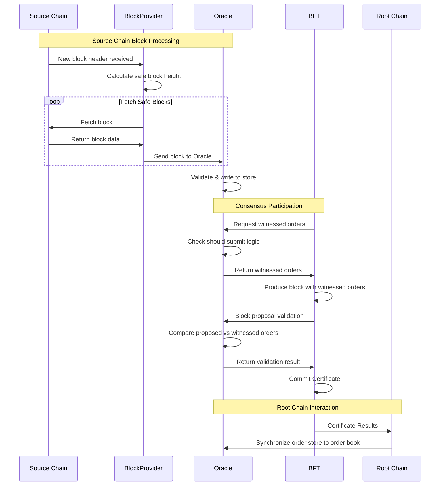

# Oracle Package

## Multi-Oracle Consensus with Validator Voting

The Oracle package provides cross-chain transaction witnessing and validation capabilities for the Canopy blockchain. It implements a chain-agnostic oracle that coordinates between source blockchains (like Ethereum) and a Canopy nested chain (observer chain) running this software to facilitate cross-chain order execution and validation.

The Canopy oracle nested chain employs a witness-based consensus mechanism that combines independent validator nodes with the NestBFT consensus algorithm to ensure reliable attestation of external blockchain transactions.

Each validator node in the committee independently monitors external chains (such as Ethereum) through configurable block providers and witnesses lock/close order transactions. When a relevant transaction is detected, oracle nodes validate it against the current order book and stores any witnessed orders locally.

They participate in the NestBFT consensus protocol where witnessed orders are proposed in blocks and validated against each nodes' witnessed orders. Thie ensures that the required +2/3 supermajority agreement among participating validators before any witnessed order is finalized on the observer chain and reported to the root chain.

## Overview

The Oracle package is designed to handle:
- Witnessing transactions on external blockchains containing Canopy lock & close orders
- Validating and storing witnessed orders in a local order store
- Participating in the BFT consensus process by providing witnessed orders for block proposals
- Synchronizing with the root chain order book to maintain consistency
- Managing persistent state for reliable order processing

## Core Components

### Oracle

The core of the Canopy Oracle system. It manages the overall cross-chain witnessing process, including:
- Receiving blocks from block providers
- Validating witnessed orders against the root chain order book
- Persisting witnessed orders to local storage
- Coordinating with the BFT consensus mechanism
- Maintaining synchronization with root chain order book state

# BlockProvider Integration

The Oracle integrates with external block providers through the `BlockProvider` interface. It provides:
- Real-time block monitoring from external chains
- Transaction parsing and order extraction
- Integration with Oracle's state management for gap detection and reorg handling

## Sequence Diagram

The following sequence diagram illustrates the core interactions in the Oracle package:

## Technical Details

### Cross-Chain Transaction Witnessing

The Oracle system uses a block-based monitoring approach to witness transactions on external chains. This is achieved by:

- **Block Provider Integration**: Connects to external blockchain nodes through configurable providers
- **Transaction Parsing**: Extracts Canopy-specific order data from external chain transactions
- **Order Validation**: Performs comprehensive validation against root chain order book data
- **State Persistence**: Maintains reliable state storage for witnessed orders and processing height

The system works like a specialized blockchain monitor that specifically looks for transactions containing Canopy order data, validates them against known orders, and stores them for later use in the consensus process.

State persistence ensures that the Oracle can recover from interruptions without losing witnessed orders or reprocessing previously seen blocks.

# BFT Consensus Integration

The Oracle system uses a dual-phase approach to participate in Byzantine Fault Tolerant consensus:

1. **Proposal Phase**: When acting as a proposer, the Oracle queries its witnessed order store to find orders that should be included in the next block proposal
2. **Validation Phase**: When validating block proposals from other nodes, the Oracle verifies that all proposed orders exist in its local witnessed order store

This ensures that only orders witnessed by a majority of validator nodes are included in the blockchain, providing strong guarantees about cross-chain transaction validity.

## Component Interactions

### 1. Block Processing: External Chain Monitoring

When a new block arrives from an external blockchain, the Oracle performs the following:

- **Block Reception**: Receives blocks through a channel-based interface from the configured BlockProvider
- **Height Persistence**: Saves the current block height to disk before processing to enable recovery
- **Transaction Analysis**: Examines each transaction in the block for Canopy-specific order data
- **Order Validation**: Validates witnessed orders against the current root chain order book
- **Storage Operations**: Persists valid orders to the local order store with appropriate metadata

### 2. Consensus Participation: BFT Integration

The Oracle participates in the BFT consensus process through two key interfaces:

- **WitnessedOrders**: Called during block proposal to provide witnessed orders that should be included in the next block
- **ValidateProposedOrders**: Called during block validation to verify that proposed orders were witnessed by this node

## Configuration

The Oracle system utilizes two primary configuration structures defined in `lib/config.go` that control both Ethereum block monitoring and Oracle consensus behavior.

### EthBlockProviderConfig

Controls how the Oracle connects to and monitors Ethereum blockchain for order transactions (`lib/config.go:288-311`):

- **`NodeUrl`** (string): Ethereum RPC node URL for fetching blocks and transaction receipts. Used by the RPC client for all read operations including block retrieval and transaction validation.
- **`NodeWSUrl`** (string): Ethereum WebSocket URL for real-time block header notifications. Enables efficient block monitoring by subscribing to new block events.
- **`EVMChainId`** (uint64): Ethereum chain ID for transaction signature validation. Ensures transaction sender addresses are correctly extracted using the appropriate chain-specific signer.
- **`RetryDelay`** (int): Connection retry delay in seconds for RPC/WebSocket failures. Prevents rapid reconnection attempts that could overwhelm nodes during network issues.
- **`SafeBlockConfirmations`** (int): Number of block confirmations required before processing. Provides protection against chain reorganizations by only processing blocks that are unlikely to be reverted.
- **`StartupBlockDepth`** (uint64): How far back to start processing when no previous height is available. Ensures the Oracle can catch recently witnessed orders after restarts.

### OracleConfig

Controls the Oracle's consensus participation and order submission behavior (`lib/config.go:313-332`):

- **`StateFile`** (string): Filename for persisting Oracle processing state. Enables recovery of the last processed block height and hash for gap detection and chain reorganization handling.
- **`OrderResubmitDelay`** (uint64): Number of root chain blocks to wait before resubmitting an order. Prevents duplicate submissions.
- **`Committee`** (uint64): Committee identifier this Oracle witnesses orders for. Must match the target committee in the root chain order book for proper order validation.
- **`ProposeLeadTime`** (uint64): Number of source chain blocks to wait before including newly witnessed orders in proposals. This allows a small amount of time for other validators to receive eth blocks should they be behind.
- **`ErrorReprocessDepth`** (uint64): How far back to reprocess blocks when sequence errors are detected. Enables recovery from chain reorganizations and missed blocks.
- **`LockOrderHoldTime`** (uint64): Number of root blocks to prevent resubmission of lock orders with the same ID. Prevents duplicate lock order submissions and potential double-spending.

### cmd/rpc/oracle/eth Package - Block and Transaction Processing

#### Next Height and Safe Height Usage

The Ethereum block provider implements a block processing system centered around height management:

- **Next Height Tracking**: The `nextHeight` field in `EthBlockProvider` tracks the next block to be processed.

- **Safe Height Calculation**: In `processBlocks()` safe height is calculated by subtracting `SafeBlockConfirmations` from the current block height received via new block header notifications. This ensures only confirmed blocks are processed, protecting against chain reorganizations.

- **Block Processing Loop**: The system processes all blocks from `nextHeight` to `safeHeight` in sequential order, fetching each block via `fetchBlock()`, processing transactions, and sending complete blocks through the unbuffered channel to the Oracle.

#### Transaction Processing for Order Data

Transaction processing follows a multi-stage validation pipeline:

- **ERC20 Detection**: `parseDataForOrders()` examines transaction data to detect ERC20 transfers using the method signature `a9059cbb` and validates data length (68 bytes minimum).

- **Self-Sent Lock Orders**: For transactions where `From()` equals `To()`, the entire transaction data is validated as lock order JSON. For ERC20 transfers with amount 0 sent to self, the extra data beyond the transfer call is validated as lock order JSON.

- **Close Order Processing**: For standard ERC20 transfers, the extra data beyond the transfer parameters is validated as close order JSON and associated with the token transfer information.

- **Transaction Success Validation**: `transactionSuccess()` fetches transaction receipts to ensure only successful on-chain transactions are processed, preventing failed transaction exploitation.

### cmd/rpc/oracle/oracle.go - Core Oracle Operations

#### The run() Method Analysis

The `run()` method implements the main Oracle processing loop with robust error handling:

- **Order Book Dependency**: Waits for valid order book before processing any blocks.

- **Height Recovery**: Uses `OracleState.GetLastHeight()` to determine starting height from persistent state, enabling crash recovery and gap detection.

- **Block Validation**: Each received block undergoes sequence validation via `stateManager.ValidateSequence()` to detect gaps and chain reorganizations before processing.

- **State Persistence**: After successful block processing, saves state atomically using `stateManager.SaveProcessedBlock()` for reliable crash recovery.

#### Order Validation Methods

**validateLockOrder() Method**:
- Verifies lock order ID matches sell order ID using byte-level comparison
- Ensures lock order chain ID matches sell order committee
- Placeholder for additional seller address validation

**validateCloseOrder() Method**:
- Validates sell order data field matches transaction recipient address (Ethereum-specific)
- Ensures close order ID matches sell order ID via byte comparison
- Verifies close order chain ID matches sell order committee
- Validates ERC20 transfer amount matches sell order requested amount
- Comprehensive validation against malicious or erroneous off-chain data

#### WitnessedOrders Method Analysis

The `WitnessedOrders()` method implements the core consensus participation logic:

- **Order Book Iteration**: Iterates through root chain order book to find corresponding witnessed orders in local store
- **Lock Order Processing**: For unlocked sell orders (BuyerReceiveAddress == nil), searches for witnessed lock orders and applies submission logic via `shouldSubmit()`
- **Close Order Processing**: For locked sell orders (BuyerReceiveAddress != nil), searches for witnessed close orders and applies submission logic
- **Submission History**: Updates `LastSubmitHeight` for each submitted order to enable resubmission delay tracking

#### ValidateProposedOrders Method Analysis

The `ValidateProposedOrders()` method ensures consensus integrity:

- **Lock Order Validation**: For each proposed lock order, retrieves witnessed order from local store and performs exact equality comparison using `lock.Equals()`
- **Close Order Validation**: For proposed close orders, constructs comparison close order with committee ID and validates equality
- **Strict Validation**: Returns validation errors if any proposed order doesn't exactly match witnessed orders, preventing malicious or incorrect proposals from being accepted
- **Comprehensive Logging**: Provides detailed logging for each validation step to aid in debugging consensus issues

### cmd/rpc/oracle/state.go - Submission Logic

#### The shouldSubmit Method Analysis

The `shouldSubmit()` method implements submission control logic with multiple validation layers:

**CHECK 1 - Propose Lead Time**:
- Compares current source chain height with witnessed height plus `ProposeLeadTime`
- Ensures sufficient confirmations have passed since the order was witnessed
- Allows time for other validators to receive and process the same Ethereum blocks
- Prevents premature submission of recently witnessed orders

**CHECK 2 - Resubmit Delay**:
- Compares current root height with last submission height plus `OrderResubmitDelay`
- Prevents rapid resubmission of the same order across consecutive root chain blocks
- Uses per-order tracking via `LastSubmitHeight` field in witnessed orders

**CHECK 3 - Lock Order Specific Restrictions**:
- Maintains `lockOrderSubmissions` map tracking when each lock order ID was first submitted
- Enforces `LockOrderHoldTime` delay between submissions of lock orders with the same ID
- Prevents duplicate lock order submissions
- Records new submission heights for lock orders upon successful validation

**CHECK 4 - General Submission History**:
- Maintains `submissionHistory` map preventing duplicate submissions within the same proposal round
- Tracks order submissions at specific root heights to prevent immediate resubmission
- Provides final approval for order submission after all other checks pass
