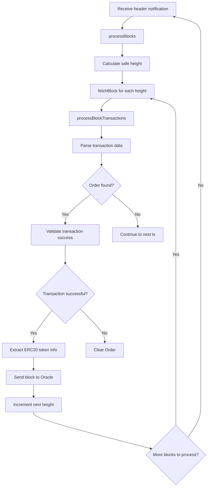
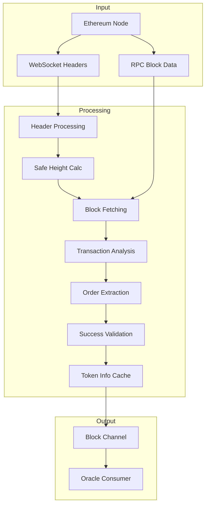
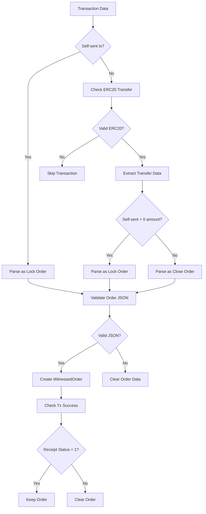
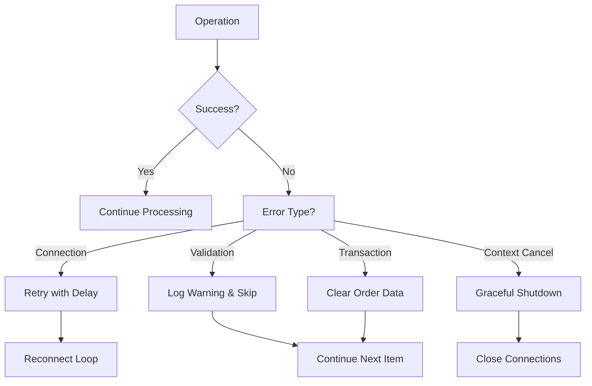
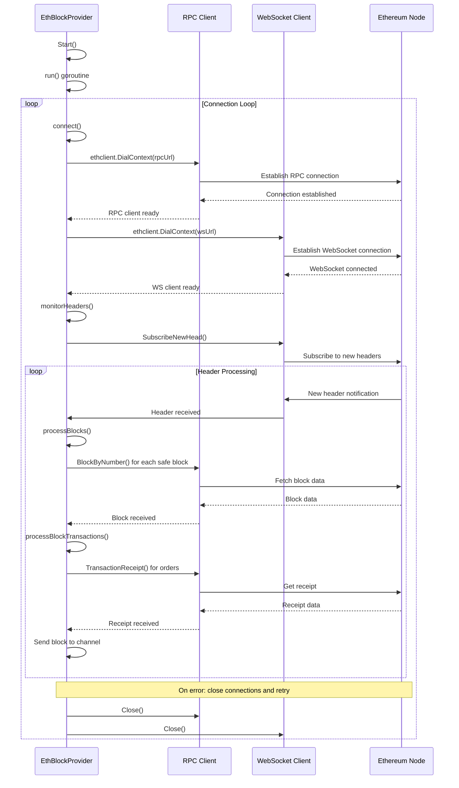
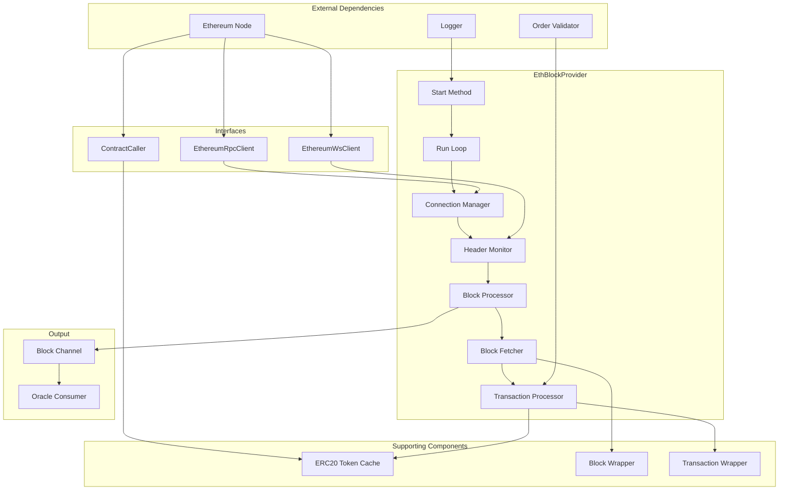

# Code Flow Analysis Report: Ethereum Block Processing Oracle

## Executive Summary
- **Component Purpose**: Real-time Ethereum blockchain monitoring system that processes blocks, validates transactions, and extracts Canopy orders for the oracle system
- **Entry Points**: `EthBlockProvider.Start()` method in `block_provider.go:148`
- **Scope**: Complete flow from Ethereum block reception through WebSocket subscriptions to order extraction and channel delivery

## Flow Diagram

## Detailed Flow Analysis

### 1. Entry Points and Initialization
- **File**: `block_provider.go:148`
- **Function**: `Start(ctx context.Context)`
- **Purpose**: Initiates the Ethereum block monitoring system
- **Input Parameters**: Context for cancellation control
- **Initial Setup**: Launches `run()` goroutine for continuous operation

### 2. Main Processing Pipeline

**Step 1: Connection Establishment** - `block_provider.go:184`
- **Location**: `connect()` method
- **Purpose**: Establishes RPC and WebSocket connections to Ethereum node
- **Input**: RPC URL and WebSocket URL from configuration
- **Processing**: 
  - Creates RPC client via `ethclient.DialContext()`
  - Creates WebSocket client for real-time subscriptions
  - Closes existing connections before establishing new ones
- **Output**: Connected RPC and WebSocket clients
- **Safeguards**: Connection validation, automatic retry on failure with configurable delay

**Step 2: Header Monitoring** - `block_provider.go:214`
- **Location**: `monitorHeaders()` method
- **Purpose**: Subscribes to new Ethereum block headers via WebSocket
- **Input**: WebSocket client and context
- **Processing**: 
  - Creates buffered channel for headers (size 10)
  - Subscribes to `SubscribeNewHead()` 
  - Processes headers as they arrive
- **Output**: Stream of new block headers
- **Safeguards**: Nil header validation, subscription error handling, graceful unsubscribe

**Step 3: Safe Block Processing** - `block_provider.go:255`
- **Location**: `processBlocks()` method
- **Purpose**: Calculates safe block height and processes all unprocessed blocks
- **Input**: Current block height from header
- **Processing**:
  - Calculates safe height: `currentHeight - safeBlockConfirmations`
  - Processes all blocks from `nextHeight` to safe height sequentially
  - Uses mutex lock for thread-safe height management
- **Output**: Processed blocks sent through channel
- **Safeguards**: Negative height protection, mutex synchronization, sequential processing

**Step 4: Block Fetching** - `block_provider.go:101`
- **Location**: `fetchBlock()` method  
- **Purpose**: Retrieves block data from Ethereum RPC and wraps transactions
- **Input**: Block height/number
- **Processing**:
  - Calls `rpcClient.BlockByNumber()` to fetch block
  - Creates `Block` wrapper with metadata
  - Wraps each transaction with `NewTransaction()`
- **Output**: `Block` instance with wrapped transactions
- **Safeguards**: Error handling for RPC failures, transaction wrapping validation

**Step 5: Transaction Processing** - `block_provider.go:298`
- **Location**: `processBlockTransactions()` method
- **Purpose**: Analyzes transactions for Canopy orders and validates success
- **Input**: Block with transactions
- **Processing**:
  - Iterates through all transactions in block
  - Calls `parseDataForOrders()` to extract order data
  - Validates transaction success via receipt check
  - Fetches ERC20 token information if applicable
- **Output**: Transactions with validated orders and token metadata
- **Safeguards**: Transaction receipt validation, order validation, token info caching

**Step 6: Order Data Parsing** - `transaction.go:72`
- **Location**: `parseDataForOrders()` method
- **Purpose**: Extracts Canopy lock/close orders from transaction data
- **Input**: Transaction data bytes and order validator
- **Processing**:
  - Detects self-sent transactions (lock orders)
  - Parses ERC20 transfer data for close orders
  - Validates order JSON against schemas
  - Creates `WitnessedOrder` instances
- **Output**: Populated order data in transaction
- **Safeguards**: JSON validation, order type checking, data length validation

## Data Flow Mapping

## Order Processing Flow

## Security Architecture

**Input Validation**
- **Location**: `transaction.go:47,205` 
- **Mechanisms**: 
  - Nil transaction checks
  - ERC20 data length validation (68 bytes minimum)
  - Method ID verification (`a9059cbb` for transfers)
  - Address format validation
- **Bypass Potential**: Method ID could be spoofed, but order validation provides secondary check

**Access Controls**
- **Authentication**: No authentication - relies on Ethereum node security
- **Authorization**: No explicit authorization controls
- **Session Management**: WebSocket connection management with automatic reconnection

**Data Protection**
- **Encryption**: Relies on TLS for RPC/WebSocket connections
- **Sensitive Data Handling**: Private keys not handled in this component
- **Audit Logging**: Extensive logging of block processing, errors, and order detection

**Rate Limiting & Resource Controls**
- **Request Limits**: No explicit rate limiting implemented
- **Resource Quotas**: Buffered channels (size 10 for headers)
- **Timeout Protections**: Context-based cancellation throughout

## Error Handling & Recovery

**Error Scenarios**

**Recovery Mechanisms**
- **Rollback Procedures**: None implemented - processes linearly
- **Retry Logic**: Connection failures retry with configurable delay
- **Circuit Breakers**: Context cancellation stops all operations
- **Graceful Degradation**: Failed transactions are skipped, processing continues

## Connection Management Flow

## Logic Analysis

**State Management**
- **State Variables**: `nextHeight` (protected by mutex), connection clients, block channel
- **State Transitions**: Height increments sequentially, connections cycle through connect/disconnect
- **Consistency Guarantees**: Sequential block processing ensures ordering
- **Concurrency Handling**: Mutex protects height updates, goroutine-safe channel operations

**Business Logic Validation**
- **Business Rules**: 
  - Only process blocks with sufficient confirmations
  - Validate transaction success before processing orders
  - Self-sent transactions indicate lock orders
  - ERC20 transfers with data indicate close orders
- **Constraint Enforcement**: JSON schema validation, transaction receipt verification
- **Edge Case Handling**: Handles nil headers, negative heights, connection failures

**Performance Considerations**
- **Bottlenecks**: 
  - Sequential block processing (no parallelization)
  - Token info contract calls for each new token
  - Transaction receipt fetching for each transaction with orders
- **Scalability**: Limited by Ethereum node RPC rate limits and single goroutine processing
- **Resource Usage**: Moderate memory usage, network I/O bound

## Architecture Assessment

**Design Patterns**
- **Patterns Used**: 
  - Observer pattern (WebSocket subscription monitoring)
  - Interface segregation (EthereumRpcClient, EthereumWsClient, ContractCaller)
  - Cache pattern (ERC20TokenCache)
  - Producer-Consumer pattern (channel-based block delivery)
- **Pattern Appropriateness**: Well-suited for real-time blockchain monitoring
- **Pattern Implementation Quality**: Good interface abstractions, proper separation of concerns

**Separation of Concerns**
- **Layer Boundaries**: 
  - Network layer (RPC/WebSocket clients)
  - Data processing layer (block/transaction parsing)  
  - Business logic layer (order extraction and validation)
  - Cache layer (token metadata)
- **Coupling Analysis**: Moderate coupling between components, interfaces help reduce dependencies
- **Cohesion Assessment**: High cohesion within each component, focused responsibilities

**Extension Points**
- **Plugin Architecture**: Order validator is injected, allowing different validation strategies
- **Configuration Options**: Comprehensive configuration via `EthBlockProviderConfig`
- **API Stability**: Uses well-defined interfaces for external dependencies

## Component Architecture

