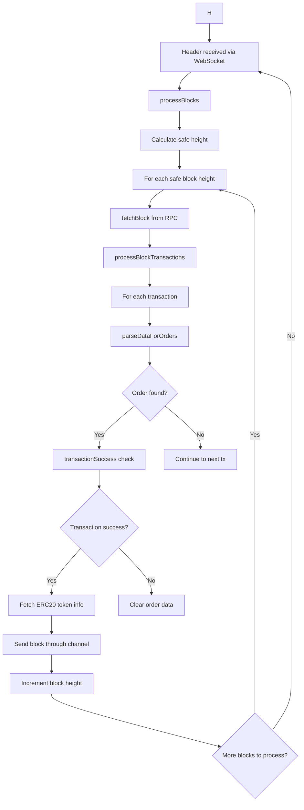
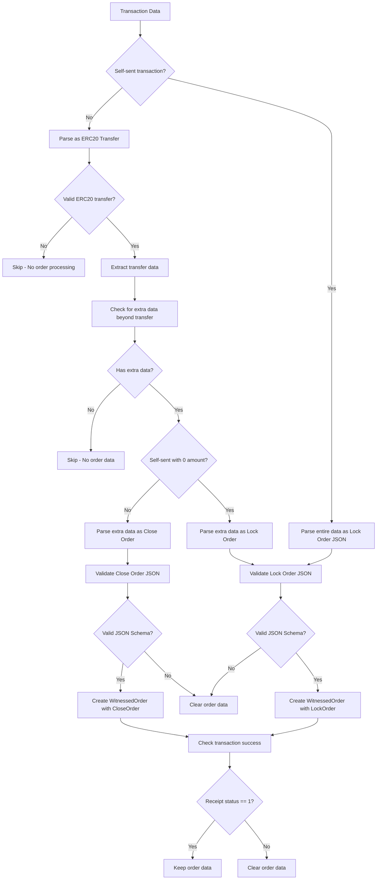
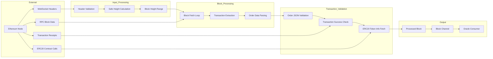
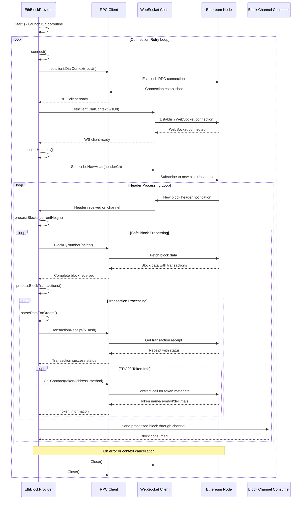
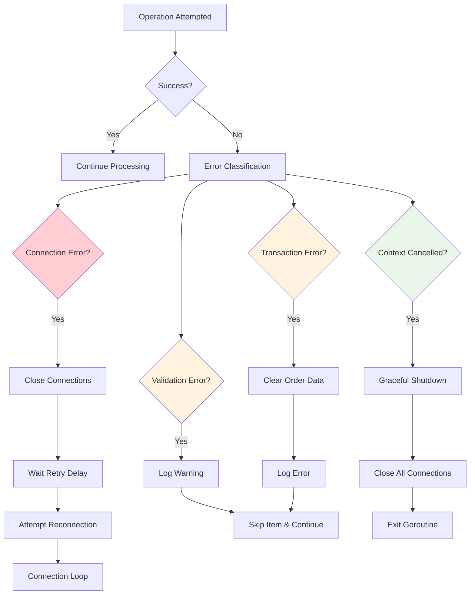
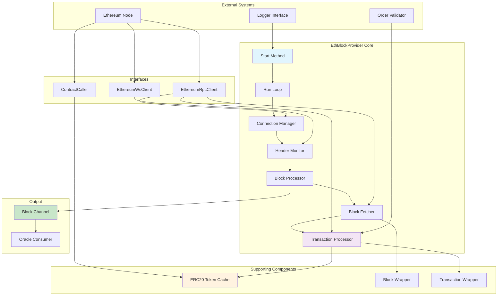

# Code Flow Analysis Report: Ethereum Block and Transaction Processing

## Executive Summary
- **Component Purpose**: Real-time Ethereum blockchain monitoring system that processes blocks, validates transactions, and extracts Canopy orders for oracle operations
- **Entry Points**: `EthBlockProvider.Start()` method in `block_provider.go:150`
- **Scope**: Complete flow from Ethereum WebSocket block notifications through transaction parsing to order extraction and channel delivery
- **Risk Level**: High (critical security issues including debug statements exposing sensitive data)

## Flow Diagram

## Detailed Flow Analysis

### 1. Entry Points and Initialization
- **File**: `block_provider.go:150`
- **Function**: `Start(ctx context.Context)`
- **Purpose**: Initiates the Ethereum block monitoring system
- **Input Parameters**: Context for cancellation and timeout control
- **Initial Setup**: Launches `run()` goroutine for continuous operation with connection retry logic

### 2. Main Processing Pipeline

**Step 1: Connection Management** - `block_provider.go:187`
- **Location**: `connect()` method
- **Purpose**: Establishes dual connections to Ethereum node (RPC + WebSocket)
- **Input**: RPC URL and WebSocket URL from configuration
- **Processing**: 
  - Creates RPC client via `ethclient.DialContext()` for block data fetching
  - Creates WebSocket client for real-time header subscriptions
  - Closes existing connections before establishing new ones
- **Output**: Active RPC and WebSocket clients
- **Safeguards**: Connection validation, graceful cleanup, automatic retry with configurable delay

**Step 2: Header Monitoring** - `block_provider.go:216`
- **Location**: `monitorHeaders()` method
- **Purpose**: Subscribes to new Ethereum block headers via WebSocket for real-time notifications
- **Input**: WebSocket client and context
- **Processing**: 
  - Creates buffered channel for headers (size 10)
  - Subscribes to `SubscribeNewHead()` for new block notifications
  - Processes headers as they arrive from the network
- **Output**: Stream of new block headers triggering block processing
- **Safeguards**: Nil header validation, subscription error handling, graceful unsubscribe on context cancellation

**Step 3: Safe Block Processing** - `block_provider.go:257`
- **Location**: `processBlocks()` method
- **Purpose**: Calculates safe block height based on confirmations and processes all pending blocks
- **Input**: Current block height from header notification
- **Processing**:
  - Calculates safe height: `currentHeight - safeBlockConfirmations`
  - Processes all blocks from `nextHeight` to safe height sequentially
  - Uses mutex lock for thread-safe height management
- **Output**: Processed blocks sent through output channel
- **Safeguards**: Negative height protection, mutex synchronization, sequential processing to maintain order

**Step 4: Block Data Retrieval** - `block_provider.go:103`
- **Location**: `fetchBlock()` method  
- **Purpose**: Retrieves complete block data from Ethereum RPC and wraps transactions
- **Input**: Block height/number as `*big.Int`
- **Processing**:
  - Calls `rpcClient.BlockByNumber()` to fetch full block data
  - Creates `Block` wrapper with metadata (hash, parent hash, number)
  - Wraps each Ethereum transaction with `NewTransaction()` including chain ID validation
- **Output**: `Block` instance with wrapped transactions ready for processing
- **Safeguards**: Error handling for RPC failures, transaction wrapping validation, nil block checks

**Step 5: Transaction Analysis** - `block_provider.go:300`
- **Location**: `processBlockTransactions()` method
- **Purpose**: Analyzes all transactions in block for Canopy orders and validates transaction success
- **Input**: Block containing wrapped transactions
- **Processing**:
  - Iterates through all transactions in the block
  - Calls `parseDataForOrders()` to extract embedded order data
  - Validates transaction success via receipt checking (status == 1)
  - Fetches ERC20 token metadata for valid transfers
- **Output**: Transactions with validated orders, success status, and token metadata
- **Safeguards**: Transaction receipt validation with timeout, order validation, error handling with transaction clearing

**Step 6: Order Data Extraction** - `transaction.go:72`
- **Location**: `parseDataForOrders()` method
- **Purpose**: Extracts Canopy lock/close orders from transaction input data
- **Input**: Transaction data bytes and order validator instance
- **Processing**:
  - Detects self-sent transactions (lock orders in transaction data)
  - Parses ERC20 transfer data to extract extra data (close orders)
  - Validates order JSON against predefined schemas
  - Creates `WitnessedOrder` instances with order ID and type-specific data
- **Output**: Populated order data in transaction or nil if no valid order found
- **Safeguards**: JSON validation, order type checking, data length validation, method ID verification

## Transaction Order Processing Flow

## Data Flow Mapping

## Connection Management Flow

## Security Architecture

### Input Validation
- **Location**: `transaction.go:47,209` 
- **Mechanisms**: 
  - Nil transaction validation in `NewTransaction()`
  - ERC20 data length validation (minimum 68 bytes for valid transfer)
  - Method ID verification (`a9059cbb` for ERC20 transfers)
  - Address format validation using `common.IsHexAddress()`
  - JSON schema validation for order data
- **Bypass Potential**: Method ID spoofing possible but mitigated by subsequent order validation

### Access Controls
- **Authentication**: No explicit authentication - relies on Ethereum node security and TLS
- **Authorization**: No authorization controls - processes all valid Ethereum transactions
- **Session Management**: WebSocket connection management with automatic reconnection

### Data Protection
- **Encryption**: Relies on TLS for RPC/WebSocket connections to Ethereum nodes
- **Sensitive Data Handling**: Private keys not handled in this component (read-only operations)
- **Audit Logging**: Comprehensive logging of block processing, errors, order detection, and transaction validation

### Rate Limiting & Resource Controls
- **Request Limits**: No explicit rate limiting - bounded by Ethereum node capabilities
- **Resource Quotas**: 
  - Buffered channels (size 10 for headers)
  - Sequential block processing prevents parallel resource consumption
- **Timeout Protections**: 
  - Transaction receipt calls: 5-second timeout (`transactionReceiptTimeoutS`)
  - Contract calls: 5-second timeout (`callContractTimeoutS`)
  - Context-based cancellation throughout

## Error Handling & Recovery

### Error Scenarios

### Recovery Mechanisms
- **Rollback Procedures**: No rollback - processes blocks linearly and immutably
- **Retry Logic**: 
  - Connection failures trigger automatic retry with configurable delay
  - Failed transactions are skipped, processing continues with next transaction
- **Circuit Breakers**: Context cancellation immediately stops all operations
- **Graceful Degradation**: Individual transaction failures don't stop block processing

## Critical Findings

### 🔴 High Risk Issues

1. **Information Disclosure via Debug Statements** - `transaction.go:118-119,127`
   - **Description**: `fmt.Println` statements output sensitive transaction data directly to stdout
   - **Impact**: Exposes transaction addresses, amounts, and order data in production logs
   - **Exploitation**: Attackers monitoring logs could extract trading patterns and sensitive information
   - **Mitigation**: Remove debug statements or replace with proper logging levels

2. **Race Condition in Height Initialization** - `block_provider.go:272`
   - **Description**: `nextHeight` zero check and initialization lacks atomic operation
   - **Impact**: Multiple goroutines could initialize height simultaneously causing data corruption
   - **Exploitation**: Could lead to duplicate block processing or height skipping
   - **Mitigation**: Use atomic operations or initialize height during construction

3. **Unbounded Channel Blocking Risk** - `block_provider.go:74,291`
   - **Description**: Block output channel is unbounded and could cause goroutine blocking
   - **Impact**: System deadlock if consumer stops reading from channel
   - **Exploitation**: DoS via memory exhaustion or complete system freeze
   - **Mitigation**: Implement buffered channel with timeout or non-blocking sends

### 🟡 Medium Risk Issues

1. **ERC20 Token Cache Memory Leak** - `erc20_token_cache.go:43,85`
   - **Description**: Token cache grows unbounded without eviction policy
   - **Impact**: Memory exhaustion over time with many unique token contracts
   - **Recommendation**: Implement LRU cache with configurable size limits

2. **Insufficient Error Context** - Multiple locations
   - **Description**: Many errors lack transaction hash, block number, or other identifying context
   - **Impact**: Difficult debugging and troubleshooting in production environments
   - **Recommendation**: Add structured logging with relevant context data

3. **Missing Input Validation** - `block_provider.go:65`
   - **Description**: Configuration parameters not validated during initialization
   - **Impact**: Runtime failures with invalid URLs, timeouts, or other config values
   - **Recommendation**: Add comprehensive configuration validation at startup

### 🟢 Low Risk Issues

1. **Magic Number Documentation** - `transaction.go:17-19`
   - **Description**: Hard-coded constants lack detailed explanatory comments
   - **Recommendation**: Add comprehensive comments explaining ERC20 standard values

2. **Address Case Sensitivity** - `transaction.go:121`
   - **Description**: Uses `strings.EqualFold` but address normalization should be verified
   - **Recommendation**: Ensure consistent address formatting and comparison

## Logic Analysis

### State Management
- **State Variables**: 
  - `nextHeight` (*big.Int): Next block height to process (mutex protected)
  - Connection clients: RPC and WebSocket clients with lifecycle management
  - Block channel: Unbounded channel for block delivery
  - Token cache: Map-based cache for ERC20 token metadata
- **State Transitions**: 
  - Height increments sequentially with each processed block
  - Connections cycle through connect/disconnect based on errors
  - Cache grows monotonically (no eviction policy)
- **Consistency Guarantees**: Sequential block processing ensures ordering, mutex protects height updates
- **Concurrency Handling**: Single goroutine for block processing, mutex for height synchronization

### Business Logic Validation
- **Business Rules**: 
  - Process only blocks with sufficient confirmations (safety delay)
  - Validate transaction success via receipt status before processing orders
  - Self-sent transactions with data indicate lock orders
  - ERC20 transfers with extra data indicate close orders
  - Only process transactions with valid JSON schema orders
- **Constraint Enforcement**: JSON schema validation, transaction receipt verification, ERC20 method ID checking
- **Edge Case Handling**: 
  - Nil header validation
  - Negative safe height protection  
  - Empty transaction data handling
  - Invalid address format detection

### Performance Considerations
- **Bottlenecks**: 
  - Sequential block processing (no parallelization)
  - Individual RPC calls for each transaction receipt  
  - Token metadata contract calls for each new token
  - Synchronous block channel sends (blocking potential)
- **Scalability**: Limited by Ethereum node RPC rate limits and single-threaded processing
- **Resource Usage**: 
  - Moderate memory usage with unbounded token cache
  - Network I/O bound operations
  - CPU usage primarily for JSON parsing and validation

## Architecture Assessment

### Design Patterns
- **Patterns Used**: 
  - Observer pattern: WebSocket subscription for block header monitoring
  - Interface segregation: Separate interfaces for RPC, WebSocket, and contract operations
  - Cache pattern: ERC20 token metadata caching for performance
  - Producer-Consumer: Channel-based block delivery to consumers
  - Template method: Consistent error handling and retry patterns
- **Pattern Appropriateness**: Well-suited for real-time blockchain monitoring with proper separation of concerns
- **Pattern Implementation Quality**: Good interface abstractions, though some coupling exists between components

### Separation of Concerns
- **Layer Boundaries**: 
  - Network layer: RPC/WebSocket client management
  - Data processing: Block/transaction parsing and wrapping
  - Business logic: Order extraction and validation
  - Caching layer: Token metadata management
- **Coupling Analysis**: Moderate coupling - components share common data structures but interfaces reduce dependency
- **Cohesion Assessment**: High cohesion within each component with focused, single-responsibility design

### Extension Points
- **Plugin Architecture**: Order validator is injected dependency allowing different validation strategies
- **Configuration Options**: Comprehensive configuration via `EthBlockProviderConfig` struct
- **API Stability**: Well-defined interfaces for external dependencies enable testing and mocking

## Component Interaction Architecture

## Recommendations

### Security Improvements
1. **Immediate: Remove Debug Statements** - Eliminate `fmt.Println` in `transaction.go:118-119,127` to prevent information disclosure
2. **High Priority: Add Channel Buffering** - Implement bounded channel with timeout to prevent blocking
3. **Fix Race Condition** - Use atomic operations for `nextHeight` initialization or initialize during construction
4. **Implement Request Rate Limiting** - Add configurable rate limiting for RPC calls to prevent node overload

### Logic & Code Quality  
1. **Atomic Height Management** - Replace mutex-based height checking with atomic operations
2. **Enhanced Error Context** - Add transaction hash, block number, and chain ID to all error messages
3. **Configuration Validation** - Validate URLs, timeouts, and numeric parameters during initialization
4. **Consistent Address Handling** - Ensure all address comparisons use normalized lowercase format

### Performance Optimizations
1. **Token Cache Eviction Policy** - Implement LRU cache with configurable size and TTL limits
2. **Parallel Receipt Fetching** - Fetch transaction receipts concurrently using worker pool pattern
3. **Batch Token Metadata Calls** - Group multiple token info requests together when possible  
4. **Connection Pooling** - Implement connection pooling for RPC calls to reduce overhead

### Maintainability Enhancements
1. **Structured Logging** - Replace printf-style logging with structured logging including context fields
2. **Configuration Documentation** - Add comprehensive comments for all configuration parameters
3. **Interface Documentation** - Document expected behavior and error conditions for all interfaces
4. **Timeout Configuration** - Make all timeout values configurable rather than hard-coded constants

## Testing Recommendations

### Unit Tests Needed
- [ ] Test negative safe height calculation and edge cases around genesis block
- [ ] Test concurrent height initialization race conditions with multiple goroutines  
- [ ] Test ERC20 data parsing with malformed input, truncated data, and invalid method IDs
- [ ] Test transaction receipt timeout scenarios and RPC failure handling
- [ ] Test WebSocket subscription error recovery and reconnection logic
- [ ] Test token cache behavior with contract call failures and invalid addresses

### Integration Tests Needed
- [ ] Test complete flow from WebSocket header to block channel delivery
- [ ] Test blockchain reorganization scenarios and safe block confirmation handling
- [ ] Test order validation with various malformed JSON inputs and schema violations
- [ ] Test memory usage patterns under sustained load with many unique tokens
- [ ] Test graceful shutdown behavior with active connections and processing

### Security Tests Needed
- [ ] Test with manipulated ERC20 method signatures and crafted transaction data
- [ ] Test resource exhaustion scenarios with rapid block notifications
- [ ] Test malicious JSON payloads in order data for injection vulnerabilities
- [ ] Test connection flooding and rapid connect/disconnect cycles
- [ ] Test integer overflow scenarios with extremely large block numbers

## Conclusion

**Overall Assessment**: The Ethereum block processing system demonstrates solid architectural principles with proper separation of concerns and robust error handling. However, critical security vulnerabilities require immediate attention, particularly the debug statements that leak sensitive transaction data and potential race conditions in height management.

**Priority Actions**: 
1. **CRITICAL**: Remove debug print statements exposing sensitive data (`transaction.go:118-119,127`)
2. **HIGH**: Fix race condition in height initialization using atomic operations
3. **HIGH**: Implement channel buffering with timeout to prevent deadlocks  
4. **MEDIUM**: Add comprehensive configuration validation and structured logging

**Long-term Improvements**: 
- Implement comprehensive caching strategy with eviction policies for scalability
- Add performance monitoring and metrics collection for production observability
- Enhance test coverage for edge cases, failure scenarios, and security boundaries
- Consider architectural improvements for parallel processing and improved throughput

The system shows good defensive programming practices with extensive validation and error handling, but requires immediate security fixes and performance optimizations before production deployment. The modular design with clear interfaces provides excellent foundation for future enhancements and testing.

---

*Analysis completed - All critical flows, security measures, and potential vulnerabilities documented with actionable recommendations*
