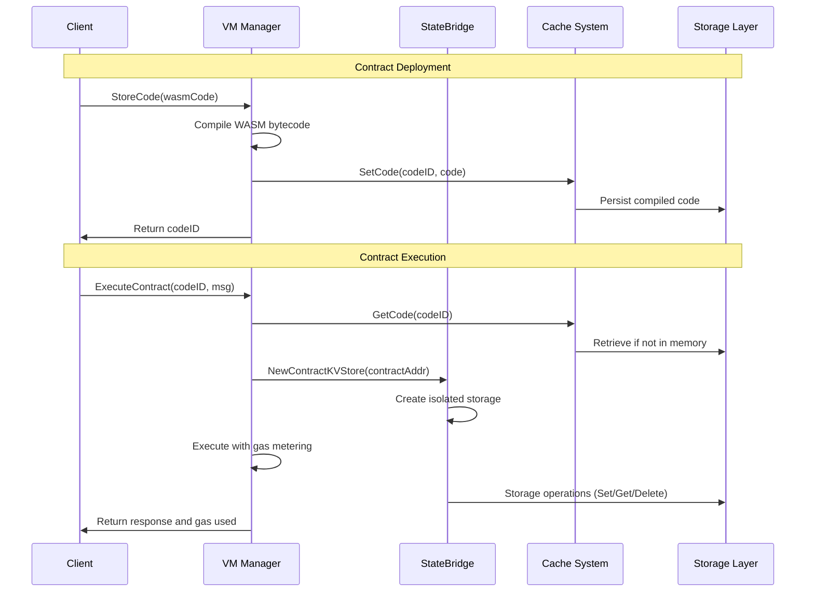

# VM Package Documentation

The VM package provides a comprehensive WebAssembly (WASM) virtual machine implementation for the Canopy blockchain network. It serves as the execution environment for CosmWasm smart contracts, managing their lifecycle from deployment to execution while providing proper resource management, gas metering, and state isolation.

## Overview

The VM package is designed to handle smart contract execution on the Canopy blockchain using the CosmWasm runtime. It provides a complete infrastructure for:

- **Contract Lifecycle Management**: Store, instantiate, execute, and query WASM smart contracts
- **Caching**: Multi-tier caching system for compiled WASM bytecode to improve performance
- **State Isolation**: Contract storage isolation using prefixed keys
- **Gas Metering**: Comprehensive gas tracking during contract execution
- **Bridge Components**: Connects CosmWasm contracts to Canopy's blockchain state

The package acts as a bridge between the blockchain and CosmWasm runtime, providing a clean interface for smart contract operations with proper resource management and error handling.

## Core Components

### VM

The main virtual machine manager that orchestrates WASM contract execution. It manages the overall contract lifecycle, including:

- **Code Storage**: Compiles and stores WASM bytecode with checksum-based identification
- **Contract Instantiation**: Creates new contract instances with proper initialization
- **Contract Execution**: Executes contract methods with gas metering and state access
- **Query Processing**: Handles read-only contract queries without state modification
- **Validation**: Validates WASM bytecode before deployment using temporary VM instances

### StateBridge

The bridge component that connects CosmWasm contracts to Canopy's state machine. It provides:

- **State Access**: Manages contract access to blockchain state through a controlled interface
- **Gas Management**: Tracks and enforces gas consumption limits across all operations
- **Address Conversion**: Handles conversion between human-readable and canonical address formats
- **Storage Operations**: Provides gas-metered storage operations (Get/Set/Delete) for contracts

### Cache System

A sophisticated multi-tier caching system that optimizes contract execution performance:

- **InMemoryCache**: Fast in-memory storage for frequently accessed compiled contracts
- **PersistentCache**: Disk-based cache using the existing BadgerDB storage system
- **HybridCache**: Combines both memory and persistent caching for optimal performance

## Sequence Diagram

The following sequence diagram illustrates the core interactions in the VM package:

## Technical Details

### Gas Metering System

The VM package uses a comprehensive gas metering system to track and limit resource consumption. This is achieved by:

- **Configurable Gas Costs**: Different operations have configurable gas costs (storage read/write/delete)
- **Multi-level Metering**: Gas is tracked at both the VM level and bridge level for comprehensive accounting
- **Out-of-Gas Protection**: Operations are immediately halted when gas limits are exceeded
- **Gas Reporting**: Detailed gas usage reporting for transaction fee calculation

Think of gas metering like a prepaid electricity meter - you load a certain amount of "credits" (gas limit) and every operation consumes some credits. When you run out, the system shuts down to prevent overconsumption.

The gas system ensures that contracts cannot consume unlimited resources, protecting the network from denial-of-service attacks.

### Address Management

The VM package uses a dual-address system to handle address conversion between human-readable and canonical formats:

1. **Human-Readable Format**: User-friendly addresses displayed in wallets and UIs
2. **Canonical Format**: Internal byte representation used for storage and computation
3. **Bidirectional Conversion**: The bridge provides conversion functions in both directions

This allows contracts to work with familiar address formats while maintaining efficient internal representation.

## Component Interactions

### 1. Contract Deployment: Code Storage and Compilation

When a new contract is deployed, the VM system handles the complete compilation and storage process:

- **Compilation**: The WASM bytecode is compiled using the CosmWasm runtime
- **Checksum Generation**: A unique checksum is generated for the compiled code
- **ID Assignment**: The system assigns a unique code ID for easy reference
- **Caching**: The compiled code is cached for efficient future access

This process is like uploading a program to a shared library - once compiled and stored, it can be used to create multiple instances.

### 2. Contract Instantiation: Creating Contract Instances

Creating a new contract instance from stored code involves several coordinated steps:

- **Code Retrieval**: The system retrieves the compiled code using the code ID
- **State Initialization**: A new isolated storage space is created for the contract
- **Initialization Logic**: The contract's initialization logic is executed
- **Instance Registration**: The new contract instance is registered in the system

Think of this like installing a program - you take the compiled program and set it up with its own data directory and configuration.

### 3. Contract Execution: Message Processing

When executing a contract method, the system orchestrates multiple components:

- **Gas Allocation**: A gas meter is created with the specified limit
- **State Access**: The contract is given access to its isolated storage
- **Message Processing**: The contract logic processes the incoming message
- **State Updates**: Any state changes are committed to storage
- **Response Generation**: The execution result is returned to the caller

This is similar to running a program with specific inputs - the program processes the inputs, potentially modifies its saved data, and returns a result.

### 4. Security and Isolation Features

The VM system implements several security and isolation features:

- **Storage Isolation**: Each contract has its own isolated storage namespace using prefixed keys
- **Gas Limits**: Prevents contracts from consuming unlimited resources
- **Address Validation**: Ensures all addresses are properly formatted and valid
- **Read-Only Queries**: Query operations cannot modify state, ensuring data integrity

These features work together like a sandbox environment - contracts can run their code but cannot interfere with other contracts or consume unlimited resources.

## Configuration

The VM package supports extensive configuration options:

- **DataDir**: Directory for VM data storage and temporary files
- **SupportedFeatures**: List of enabled CosmWasm features (iterator, staking, stargate)
- **MemoryLimit**: Maximum memory per contract execution (default: 32 MiB)
- **CacheSize**: Number of compiled contracts to cache (default: 100)
- **GasCosts**: Configurable gas costs for different operation types
